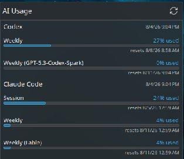

# AI Usage widget

A KDE Plasma 6 panel widget showing live Claude Code and Codex subscription usage.


Each provider gets a ring and a percentage in the panel. Click for the full breakdown:
every rate-limit window, how much is used, and when it resets.



## Why not just call the usage APIs

Because that means storing and refreshing OAuth tokens yourself against two undocumented
endpoints. This reads limits through the vendors' own CLIs instead, so authentication stays
their problem. Both probes are free — no tokens, no model calls:

| Provider | How it's read | Cost |
| --- | --- | --- |
| Codex | `codex app-server` → `account/rateLimits/read` | none |
| Claude | `claude --print /usage --output-format json` | none |

## Requirements

- KDE Plasma 6 and Python 3.11+
- [Codex CLI](https://github.com/openai/codex) and/or [Claude Code](https://claude.com/claude-code),
  signed in to a subscription plan

Accounts on API-key, Bedrock, or usage-based plans have no subscription windows to report,
so those providers show as unavailable rather than showing a wrong number.

## Install

```bash
git clone https://github.com/NicL9923/ai-usage-widget
cd ai-usage-widget
./scripts/install.sh
```

Then right-click your panel → **Add widgets** → **AI Usage**.

## The helper on its own

The widget is a thin shell over `ai-usage`, which is useful directly:

```bash
ai-usage --plain            # human readable
ai-usage                    # JSON, for a status bar or script
ai-usage --refresh          # ignore the cache
ai-usage --provider codex   # one provider
```

Results are cached in `$XDG_CACHE_HOME/ai-usage-widget/` for five minutes by default, so
polling is cheap. If a refresh fails, the last good reading is kept and marked stale rather
than blanking the display.

## Configuration

Right-click the widget → **Configure**: which providers to show, how often to check, whether
to label the percentages, and the path to the helper.

## Development

See [AGENTS.md](AGENTS.md) for the repo map, conventions, and verification steps.

```bash
python3 -m venv .venv && .venv/bin/pip install -e '.[dev]'
git config core.hooksPath .githooks
.venv/bin/python -m pytest
```

## License

MIT
