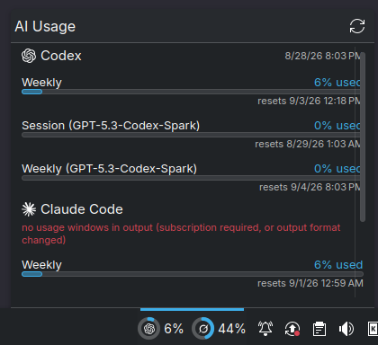

<div align="center">

# AI Usage

Claude Code, Codex, and Grok subscription usage in your KDE Plasma panel.

[](https://github.com/NicL9923/ai-usage-widget/actions/workflows/ci.yml)
[](LICENSE)
[](https://kde.org/plasma-desktop/)



</div>

Each provider gets a usage ring in the panel. Open the widget to see every rate-limit
window, its reset time, and any Codex resets you have banked. Rings turn orange at 70% and
red at 85%. A warning badge names any window at 85% or higher, including weekly and
model-specific limits, while the ring continues to show the primary window.

The widget uses the provider CLIs you already have signed in. It does not read or store
OAuth tokens, make model calls, or add anything to your bill.

| Provider | Usage source |
| --- | --- |
| Codex | `codex app-server` |
| Claude Code | `claude --print /usage` |
| Grok | `grok agent` |

## Requirements

- KDE Plasma 6
- Python 3.11 or newer
- At least one supported CLI, signed in to a subscription plan:
  [Codex](https://github.com/openai/codex),
  [Claude Code](https://claude.com/claude-code), or
  [Grok](https://docs.x.ai/build/cli)

API-key and usage-based accounts do not expose subscription windows and will appear
unavailable.

## Install

```bash
git clone https://github.com/NicL9923/ai-usage-widget.git
cd ai-usage-widget
./scripts/install.sh
```

Then right-click the panel, choose **Add widgets**, and add **AI Usage**. If it is missing
from the list, restart Plasma:

```bash
systemctl --user restart plasma-plasmashell.service
```

Update an existing installation with:

```bash
git pull
./scripts/install.sh --restart-plasma
```

## Configure

Right-click the widget and choose **Configure AI Usage** to select providers, change the
refresh interval, or show provider names. Middle-click the widget to refresh immediately.

The helper caches readings under `$XDG_CACHE_HOME/ai-usage-widget/`. One provider failing
does not block the others, and a failed refresh keeps the last good value visible and marked stale, with its age and the
refresh error. Enabled providers without readings keep their place in the panel and show
an unavailable marker.

The popup shows relative reset times, with exact local timestamps on hover. A passed
reset time does not clear the usage reading until the provider reports a new value.
Refreshes show a busy indicator and repeated requests share the active refresh. You can
also focus the panel widget with the keyboard and open it with Enter or Space.

## Use the helper by itself

The installer also adds `ai-usage` to `~/.local/bin`:

```bash
ai-usage                    # JSON for scripts and status bars
ai-usage --plain            # human-readable output
ai-usage --refresh          # bypass the cache
ai-usage --provider codex   # query one provider
ai-usage --ttl 600          # accept cache entries up to 10 minutes old
```

The helper has no runtime dependencies outside the Python standard library. Run it from a
clone without installing it with `PYTHONPATH=src python3 -m ai_usage`.

## Troubleshooting

Run a provider probe directly to see its error:

```bash
ai-usage --provider claude --refresh --plain
```

- **Warning icon.** Hover it for the helper error. Check that `~/.local/bin/ai-usage`
  exists and that the configured helper path is correct.
- **Unavailable provider.** Confirm that its CLI can show subscription usage and is signed
  in. Grok can omit its percentage until the current period has some usage.
- **Frozen numbers.** Middle-click the widget or use `ai-usage --refresh`.
- **Blank widget after an update.** Check QML errors with
  `journalctl --user --since "-5 min" | grep -i qml`.

## Uninstall

```bash
kpackagetool6 -t Plasma/Applet -r com.nicl9923.aiusage
rm -f ~/.local/bin/ai-usage
rm -rf "${XDG_CACHE_HOME:-$HOME/.cache}/ai-usage-widget"
```

## Development

```bash
python3 -m venv .venv
.venv/bin/pip install -e '.[dev]'
.venv/bin/ruff check .
.venv/bin/ruff format --check .
.venv/bin/pytest
node --test tests/test_ui.cjs
```

The widget state tests use Node.js's built-in test runner.

Issues and pull requests are welcome. Provider output is not a stable API, so parser fixes
are especially useful.

Provider marks come from [Simple Icons](https://simpleicons.org/) and
[SVG Logos](https://github.com/gilbarbara/logos), both CC0-1.0. Provider names and marks
belong to their respective owners. This project is not affiliated with them.

Released under the [MIT license](LICENSE).
